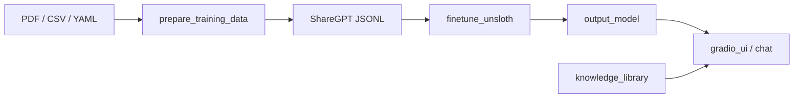

# SLM Domain Foundry

A **domain-adaptive pipeline for training small language models (SLMs)** — from your own documents and Q&A data to a model you can chat with in a browser or terminal.

The default profile targets **medical AI** (clinical Q&A, guidelines, vocabulary expansion), but the same pipeline adapts to legal, financial, scientific, or any other vertical by editing YAML config files.

## What it does



1. **Data** — Ingest PDFs (manual mode), CSV Q&A, YAML patterns, or vocabulary files.
2. **Training data** — Chunk, extract, and convert to Alpaca / ShareGPT JSONL.
3. **Training** — Fine-tune a small base model (Unsloth + QLoRA) or train from scratch.
4. **Inference** — Gradio web UI, CLI chat, optional Ollama backend, RAG-lite from a knowledge library.

## Prerequisites

- Python **3.10+**
- **CUDA 11.8+** for GPU training with Unsloth (optional; CPU paths available)
- **Docker** (optional, for reproducible environments)

## Quick start (medical example)

Clone from your Git host (private Gitea today; public GitHub after release):

```bash
git clone http://workstation.local:3000/agkhan/slm-domain-foundry.git
# After public release: git clone https://github.com/agkhan/slm-domain-foundry.git
cd slm-domain-foundry
python -m venv venv
source venv/bin/activate
pip install -r requirements.txt
# GPU training: pip install unsloth
```

### 1. Prepare training data

```bash
python -m data.prepare_training_data \
  --csv sample_data/medical_qa.csv \
  --yaml-dir sample_data/patternexamples \
  --output-dir training_data
```

Optional: expand structured vocabulary (adds many Q&A pairs from `data/medical_vocabulary.yaml`):

```bash
python -m data.prepare_training_data \
  --csv sample_data/medical_qa.csv \
  --vocab-dir data \
  --output-dir training_data
```

### 2. Fine-tune

```bash
python -m train.finetune_unsloth \
  --config config.yaml \
  --train-file training_data/train_sharegpt.jsonl \
  --val-file training_data/val_sharegpt.jsonl
```

### 3. Run inference

```bash
python -m app.gradio_ui --model-dir output_model
# Open http://127.0.0.1:7860
```

## Configuration

All defaults live in **`config.yaml`** at the repo root. CLI flags override config values.

```yaml
domain:
  name: medical
  system_prompt: "You are a medical AI assistant..."
  config_file: domain_config.yaml

model:
  base_model: unsloth/Llama-3.2-1B-Instruct
  epochs: 3
  learning_rate: 0.0002

paths:
  training_data: training_data
  output_model: output_model
```

**Domain extraction patterns** (keywords, example section labels, structured-content detection) live in **`domain_config.yaml`**. Point to a different file with:

```bash
python -m data.prepare_training_data --domain-config examples/domain_config_sql.yaml ...
```

### Adapting to other domains

| Domain | System prompt | Domain config | Sample data |
|--------|---------------|---------------|-------------|
| Medical (default) | `config.yaml` → `domain.system_prompt` | `domain_config.yaml` | `sample_data/medical_qa.csv` |
| SQL / analytics | Edit prompt in `config.yaml` | `examples/domain_config_sql.yaml` | `data/sql_vocabulary.yaml` |
| Financial | Edit prompt in `config.yaml` | Copy `domain_config.yaml`, add keywords | `data/financial_vocabulary.yaml` |

Override the chat system prompt without editing files:

```bash
export SLM_SYSTEM_PROMPT="You are a legal research assistant..."
python -m app.gradio_ui --model-dir output_model
```

## Install options

| File | Use case |
|------|----------|
| `requirements-core.txt` | Data prep only (no PyTorch) |
| `requirements-train.txt` | Full training stack |
| `requirements-inference.txt` | CPU/GPU inference + Gradio |
| `requirements.txt` | Everything (default) |

Or install as a package:

```bash
pip install -e ".[train]"    # training
pip install -e ".[inference]" # demo UI
pip install -e ".[dev]"       # pytest
```

## Docker

```bash
docker build -t slm-domain-foundry .
docker run --rm -v "$(pwd)/sample_data:/data" slm-domain-foundry \
  python -m data.prepare_training_data --csv /data/medical_qa.csv --output-dir /data/training_data
```

## Project layout

```
slm-domain-foundry/
├── config.yaml              # Main pipeline config
├── domain_config.yaml       # Domain keywords & extraction patterns
├── examples/                # Alternate domain profiles (e.g. SQL)
├── data/
│   ├── prepare_training_data.py
│   ├── medical_vocabulary.yaml
│   └── ...
├── train/
│   ├── config.py            # Config loader
│   └── finetune_unsloth.py
├── app/
│   ├── gradio_ui.py         # Web UI
│   └── chat.py              # CLI chat
├── sample_data/
│   ├── medical_qa.csv
│   └── patternexamples/     # YAML clinical patterns
└── tests/
```

## Testing

```bash
pytest tests/ --tb=short
pytest tests/ --cov=app --cov=data --cov=train --cov-report=term-missing
./scripts/security_scan.sh   # optional pre-release dependency + secrets check
```

## Repository & issues

| Host | URL | Status |
|------|-----|--------|
| Gitea | `http://workstation.local:3000/agkhan/slm-domain-foundry` | Active (private) |
| GitHub | `https://github.com/agkhan/slm-domain-foundry` | Planned public release |

Report bugs via your Gitea issue tracker until the GitHub repository is public.

## License

MIT — see [LICENSE](LICENSE). Contributions welcome — see [CONTRIBUTING.md](CONTRIBUTING.md).

## Roadmap

Phase 2 enhancements (synthetic data generation, ORPO alignment, DAPT, RAG-augmented fine-tuning, Korean language support) are tracked in [repo_actions.md](repo_actions.md).
