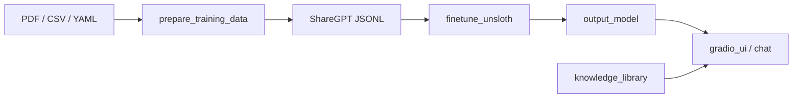

# SLM Domain Foundry

A **domain-adaptive pipeline for training small language models (SLMs)** — from your own documents and Q&A data to a model you can chat with in a browser or terminal.

The default profile targets **medical AI** (clinical Q&A, guidelines, vocabulary expansion), but the same pipeline adapts to legal, financial, scientific, or any other vertical by editing YAML config files.

## What it does



1. **Data** — Ingest PDFs (manual mode), CSV Q&A, YAML patterns, or vocabulary files.
2. **Training data** — Chunk, extract, and convert to Alpaca / ShareGPT JSONL.
3. **Training** — Fine-tune a small base model (Unsloth + QLoRA) or train from scratch.
4. **Inference** — Gradio web UI, CLI chat, optional Ollama backend, RAG-lite from a knowledge library.

## Prerequisites

- Python **3.10+**
- **CUDA 11.8+** for GPU training with Unsloth on NVIDIA hardware (optional)
- **Apple Silicon Mac** — native install + `run_local.sh` for MPS GPU training/inference (see [Hardware & platforms](#hardware--platforms))
- **Docker** (optional; see [Docker](#docker) — **CPU-only on Mac; no Metal/MPS in containers**)

## Hardware & platforms

> **Docker on Mac:** Docker Desktop runs a **Linux VM**. Containers **cannot use Apple Metal/MPS**, even on Apple Silicon. Docker on Mac is fine for **CPU-only** data prep or smoke tests, but for GPU training or inference on a Mac use a **native venv** (`requirements-mps.txt` + `run_local.sh`). On Linux with an NVIDIA GPU, use `docker-compose.gpu.yml` or a native CUDA install instead.

| Platform | Training | Inference | Verify on this machine |
|----------|----------|-----------|----------------------|
| **CPU** | `train/finetune_cpu.py` (float32) | `app/model_loader.py` | `pytest tests/ --ignore=tests/real/test_apple_silicon_mps.py --ignore=tests/real/test_cuda_gpu.py` |
| **Apple Silicon (MPS)** | `train/finetune_cpu.py` (LoRA, float16) | `app/model_loader.py` on MPS | `pytest tests/real/test_apple_silicon_mps.py -m mps` · `./scripts/sample_medical_build.sh` · `./run_local.sh` |
| **NVIDIA CUDA** | `train/finetune_unsloth.py` (Unsloth + QLoRA) or `finetune_cpu.py` | Unsloth or transformers | `pytest tests/real/test_cuda_gpu.py -m gpu` · or `./scripts/run_tests_amdworkstation.sh` from your Mac |

Device selection is automatic: **CUDA → MPS → CPU** (`app/model_loader.py`, `train/finetune_cpu.py`).

Full test matrix and remote CUDA workflow: **[tests/TESTING.md](tests/TESTING.md)**.

## Quick start (medical example)

```bash
git clone https://github.com/akhendup/slm-domain-foundry.git
cd slm-domain-foundry
python -m venv venv
source venv/bin/activate
pip install -r requirements.txt
# GPU training: pip install unsloth
```

### 1. Prepare training data

```bash
python -m data.prepare_training_data \
  --csv sample_data/medical_qa.csv \
  --yaml-dir sample_data/patternexamples \
  --output-dir training_data
```

Optional: expand structured vocabulary (adds many Q&A pairs from `data/medical_vocabulary.yaml`):

```bash
python -m data.prepare_training_data \
  --csv sample_data/medical_qa.csv \
  --vocab-dir data \
  --output-dir training_data
```

### 2. Fine-tune

```bash
python -m train.finetune_unsloth \
  --config config.yaml \
  --train-file training_data/train_sharegpt.jsonl \
  --val-file training_data/val_sharegpt.jsonl
```

### 3. Run inference

```bash
python -m app.gradio_ui --model-dir output_model
# Open http://127.0.0.1:7860
```

### One-command sample build (medical demo)

Train an instruct model end-to-end on bundled clinical sample data (CSV, YAML patterns, and **`medical_vocabulary.yaml` expansion**):

```bash
chmod +x scripts/sample_medical_build.sh
./scripts/sample_medical_build.sh
```

Defaults:
- **Model**: `unsloth/Llama-3.2-1B-Instruct` (same base as `config.yaml`; override with `SAMPLE_MODEL=...`)
- **Data**: `sample_data/medical_qa.csv`, `sample_data/patternexamples/`, plus combinatorial expansion from `data/medical_vocabulary.yaml` only (~430 Q&A pairs total). The script prints sample rows and writes full JSONL under `training_data/` as the reference dataset.
- **Training**: 500 optimizer steps by default (practical on MPS/CPU); set `SAMPLE_MAX_STEPS=0` for a full epoch on the full dataset.
- **Output**: fine-tuned weights in `output_model/`

Useful overrides:
- `SKIP_TRAIN=1` — prepare data and preview examples only (inspect `training_data/` without training)
- `SKIP_VOCAB=1` — skip vocabulary expansion (smaller/faster, not representative)
- `SAMPLE_MAX_STEPS=0` — train a full epoch instead of the 500-step demo cap

## Apple Silicon (Mac)

Use a **native Python venv** on Mac — not Docker — for MPS GPU access. See the [Hardware & platforms](#hardware--platforms) table for the full matrix.

```bash
chmod +x run_local.sh
./run_local.sh
```

That script creates a venv, installs **`requirements-mps.txt`** (PyTorch with MPS, HF Trainer + LoRA, Gradio; skips CUDA-only packages like `bitsandbytes`), detects MPS, and starts the Gradio UI. The UI automatically selects **`finetune_cpu`** when CUDA/Unsloth is unavailable.

Manual MPS install:

```bash
python3 -m venv .venv && source .venv/bin/activate
pip install -r requirements-mps.txt
python -c "import torch; print('MPS:', torch.backends.mps.is_available())"
```

CLI training on Mac (MPS):

```bash
python -m train.finetune_cpu \
  --train-file training_data/train_sharegpt.jsonl \
  --val-file training_data/val_sharegpt.jsonl \
  --model-name unsloth/Llama-3.2-1B-Instruct \
  --output-dir output_model
```

`finetune_cpu.py` auto-detects **CUDA → MPS → CPU** at startup — on Apple Silicon it automatically trains with MPS (float16 + LoRA). Use a 1B–3B base model for practical memory and speed.

## Configuration

All defaults live in **`config.yaml`** at the repo root. CLI flags override config values.

```yaml
domain:
  name: medical
  system_prompt: "You are a medical AI assistant..."
  config_file: domain_config.yaml

model:
  base_model: unsloth/Llama-3.2-1B-Instruct
  epochs: 3
  learning_rate: 0.0002

paths:
  training_data: training_data
  output_model: output_model
```

**Domain extraction patterns** (keywords, example section labels, structured-content detection) live in **`domain_config.yaml`**. Point to a different file with:

```bash
python -m data.prepare_training_data --domain-config examples/domain_config_financial.yaml ...
```

### Adapting to other domains

| Domain | System prompt | Domain config | Sample data |
|--------|---------------|---------------|-------------|
| Medical (default) | `config.yaml` → `domain.system_prompt` | `domain_config.yaml` | `sample_data/medical_qa.csv` |
| Financial | Edit prompt in `config.yaml` | `examples/domain_config_financial.yaml` | `data/financial_vocabulary.yaml` |
| Custom | Edit prompt in `config.yaml` | Copy `domain_config.yaml`, add keywords | Your CSV / YAML patterns |

Override the chat system prompt without editing files:

```bash
export SLM_SYSTEM_PROMPT="You are a legal research assistant..."
python -m app.gradio_ui --model-dir output_model
```

## Install options

| File | Use case |
|------|----------|
| `requirements-mps.txt` | Apple Silicon native (MPS training + Gradio; no bitsandbytes) |
| `requirements-core.txt` | Data prep only (no PyTorch) |
| `requirements-train.txt` | Full training stack |
| `requirements-inference.txt` | CPU/GPU inference + Gradio |
| `requirements.txt` | Everything (default) |

Or install as a package:

```bash
pip install -e ".[train]"    # training
pip install -e ".[mps]"      # Apple Silicon native (MPS + Gradio)
pip install -e ".[inference]" # demo UI
pip install -e ".[dev]"       # pytest
```

## Docker

> **Mac:** `docker compose up` runs **Linux CPU only** — no MPS. For Apple Silicon GPU training, use [native install](#apple-silicon-mac) instead.

**CPU container** (any host, including Mac — data prep and CPU inference only):

```bash
docker build -t slm-domain-foundry .
docker run --rm -v "$(pwd)/sample_data:/data" slm-domain-foundry \
  python -m data.prepare_training_data --csv /data/medical_qa.csv --output-dir /data/training_data
```

**NVIDIA GPU** (Linux host with NVIDIA Container Toolkit only — not Docker Desktop on Mac):

```bash
docker compose -f docker-compose.yml -f docker-compose.gpu.yml up --build
```

See `docker-compose.yml` header comments for details.

## Project layout

```
slm-domain-foundry/
├── config.yaml              # Main pipeline config
├── domain_config.yaml       # Domain keywords & extraction patterns
├── examples/                # Alternate domain profiles (e.g. financial)
├── data/
│   ├── prepare_training_data.py
│   ├── medical_vocabulary.yaml
│   └── ...
├── train/
│   ├── config.py            # Config loader
│   └── finetune_unsloth.py
├── app/
│   ├── gradio_ui.py         # Web UI
│   └── chat.py              # CLI chat
├── sample_data/
│   ├── medical_qa.csv
│   └── patternexamples/     # YAML clinical patterns
└── tests/
```

## Testing

Platform-specific integration tests live under `tests/real/`. See **[tests/TESTING.md](tests/TESTING.md)** for the full hardware matrix.

```bash
# Default suite (CPU logic; excludes MPS/CUDA-only files)
pytest tests/ --ignore=tests/real/test_apple_silicon_mps.py --ignore=tests/real/test_cuda_gpu.py --tb=short

# Apple Silicon (native Mac only)
pytest tests/real/test_apple_silicon_mps.py -m mps

# NVIDIA CUDA (Linux workstation, or from Mac via SSH)
./scripts/run_tests_amdworkstation.sh

pytest tests/ --cov=app --cov=data --cov=train --cov-report=term-missing
./scripts/security_scan.sh   # optional pre-release dependency + secrets check
```

## Repository & issues

Report bugs and feature requests via [GitHub Issues](https://github.com/akhendup/slm-domain-foundry/issues).

## License

MIT — see [LICENSE](LICENSE). Contributions welcome — see [CONTRIBUTING.md](CONTRIBUTING.md).

## Roadmap

Phase 1 is complete (medical default, MPS documented, domain-neutral codebase). Phase 2 enhancements include synthetic data generation, ORPO preference alignment, DAPT, RAG-augmented fine-tuning, and multilingual support — tracked via [GitHub Issues](https://github.com/akhendup/slm-domain-foundry/issues).
